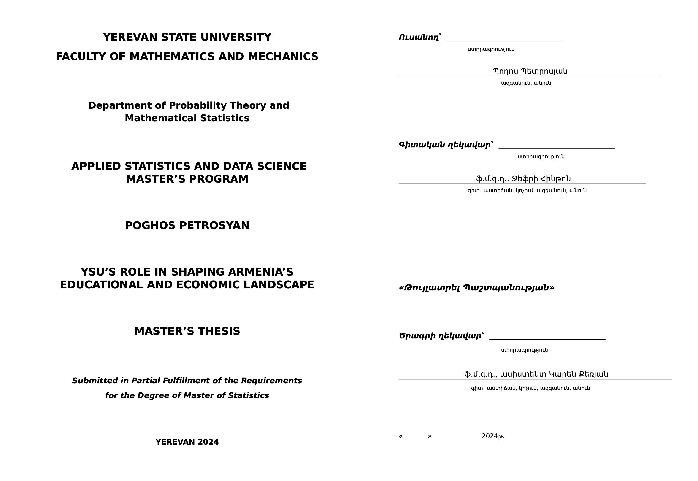

# LaTeZ: ԵՊՀ մագիստրոսական թեզի պատրաստման ոչ պաշտոնական LaTeX ձևանմուշ

Այս ձևանմուշը պատրաստվել է ԵՊՀ Կիրառական Վիճակագրություն և Տվյալների Գիտություն (ԿՎՏԳ) կրթական ծրագրի 2024թ.-ի շրջանավարտների կողմից՝ նպատակ ունենալով ստանալ ԵՊՀ մագիստրոսական թեզի պատրաստման կարգին համապատասխան LaTeX template։

**Ուշադրություն**։ Ձևանմուշում օգտագործված տեքստը գեներացված է լեզվական մեծ մոդելի կողմից։ Գեներացված տեքստը և հղումները կարող են չհամապատասխանել իրականությանը։ 

Ձևանմուշը օգտագործելու համար պետք է ներբեռնել այս ռեպոզիտորիայի ֆայլերը Download ZIP կամ git clone եղանակով, այնուհետև խմբագրել ՝template.tex՝ ֆայլը՝ գրելով Ձեր և ղեկավարի անձնական տվյալները, թեզի հայերեն, անգլերեն, ռուսերեն վերնագրերը համապատասխան դաշտերում, և շարադրել թեզի տեքստը։

Խմբագրված source-ը կոմպիլացնելու համար անհրաժեշտ է օգտագործել LuaLaTeX compiler-ը։ [Overleaf](https://www.overleaf.com/) online խմբագրիչում LuaLaTeX-ը կարող եք ընտրել որպես կոմիլյատոր` սեղմելով Menu կոճակի վրա և Comiler դաշտում ընտրելով LuaLaTeX, ինչպես ցույց է տրված ստորև նկարում

Ձևանմուշի pre-compile արված տարբերակը կարող եք տեսնել բացելով `YSU-Master-Thesis-Template.pdf` ֆայլը։

Ձևանմշուշի՝ ԵՊՀ մագիստրոսական թեզի պատրաստման կարգի հետ անհամապատասխանություններ գտնելու դեպքում խնդրում ենք ստեղծել խնդիրը նկարագրող issue, կամ խնդիրը նկարագրող և լուծող pull request։

Եթե հավանեցիք LaTeZ ձևանմուշը մագիստրոսական թեզերի պատրաստման համար, աստղ ⭐ դրեք ռեպոզիտորիային և կիսվեք Ձեր ընկերների հետ։ Հուսով ենք՝ այս ձևանմուշը հնարավորություն կտա մի փոքր ժամանակ խնայել, և փոխարենը կենտրոնանալ որակյալ հետազոտական աշխատանք կատարելու վրա

